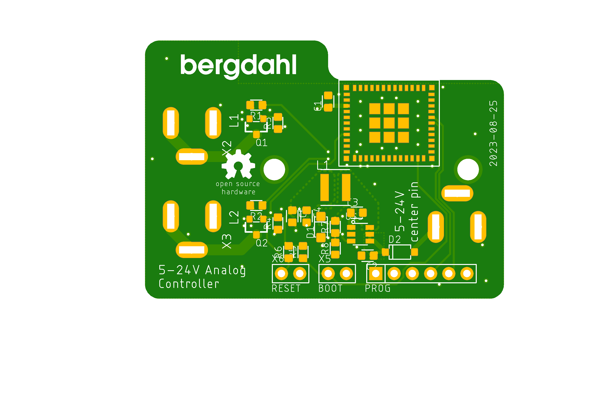

# LED_USB_Analog_Controller

This repository contains 2 version of a two channel analog LED controller. One is for 5V USB connected lights, and the other is for 5-24V lights using standard 5.5/2.1 mm power jacks. They are based on an ESP32-PICO-MINI-2 module, and I use it with ESPHome firmware to publish the lights to Home Assistant. Inside of Home Assistant you can dim the lights and turn them on or off.

> Note: The 24V version is work in progress!

PCB design files are available in [EAGLE format](pcb/).

The Schematic is also available in PDF Format, [USB version](pcb/USB_Analog_Controller.pdf) and [Power jack version](pcb/USB_Analog_Controller%2024V.pdf).

## Parts needed

BOM file are located here: [USB version](pcb/USB_Analog_Controller.csv), [Power jack version](pcb/USB_Analog_Controller%2024V.csv).

The gerber files for PCB manufacturing are located in the [gerber folder](gerber/).

I highly recommend you order a stencil together with the PCB, as the ESP32 module only exposes tiny pads on the bottom of the module and it is hard to get the correct amount of solder paste without one.

### USB version

### Power jack version

See the [BOM file](pcb/LED_USB_Analog_Controller.csv) for the component list.

The enclosure files are located in the [enclosure folder](enclosure/). There are two `3mf` files for 3D printing for each device, and I also added the original _Fusion 360_ design files in case you need to make modifications.

## Assembly

 Start by soldering all SMD parts onto the PCB. I used a hot plate for resoldering, but a hot air soldering station will also work. Continue by using a soldering iron to solder the connectors. For the USB version, Cut an existing USB cable or do like me and solder up your own, and screw plus and minus to the screw terminals (Depending on the power usage of the lights, you may need thicker cables than normal USB cables, that is why I make my own power only ones). 

The enclosure is press fit so does not need any extra hardware or tools.

## Programming

Create a new device in _ESPHome_ and replace the `yaml` with the contents of [the yaml code here](firmware/led1.yaml). Change `name` and `friendly_name` as needed.

The actual programming is done by using a standard FT232 serial board connected to the programming header. If you don't own a FT232 adapter, you can use other types of serial adapters by hooking up `GND`, `TX` and `RX` like this.

Insert the programmer and short the `BOOT` header. It can be done by soldering a temporary lead between the pads (I just insert tweezers into the pads). Apply power and it is ready for programming.

In _EspHome_,  click `Install` - `Manual download` - `Modern format`. _EspHome_ will compile the code and after couple of minutes the firmware file will be downloaded. 

Open the [ESPHome programming page](https://web.esphome.io/) and click `CONNECT`. Select the FT232 serial port and click `Connect`. Select `Install` and then click `Select file`. Select the file downloaded in the previous step and then click `Install`. The install will now proceed.

When install is finished, just remove the FT232 board and `BOOT` jumper, disconnect and connect power, and after a while Home Assistant will autodetect it. Just add the device as usual and you will get a device with the following entities in Home Assistant. 

